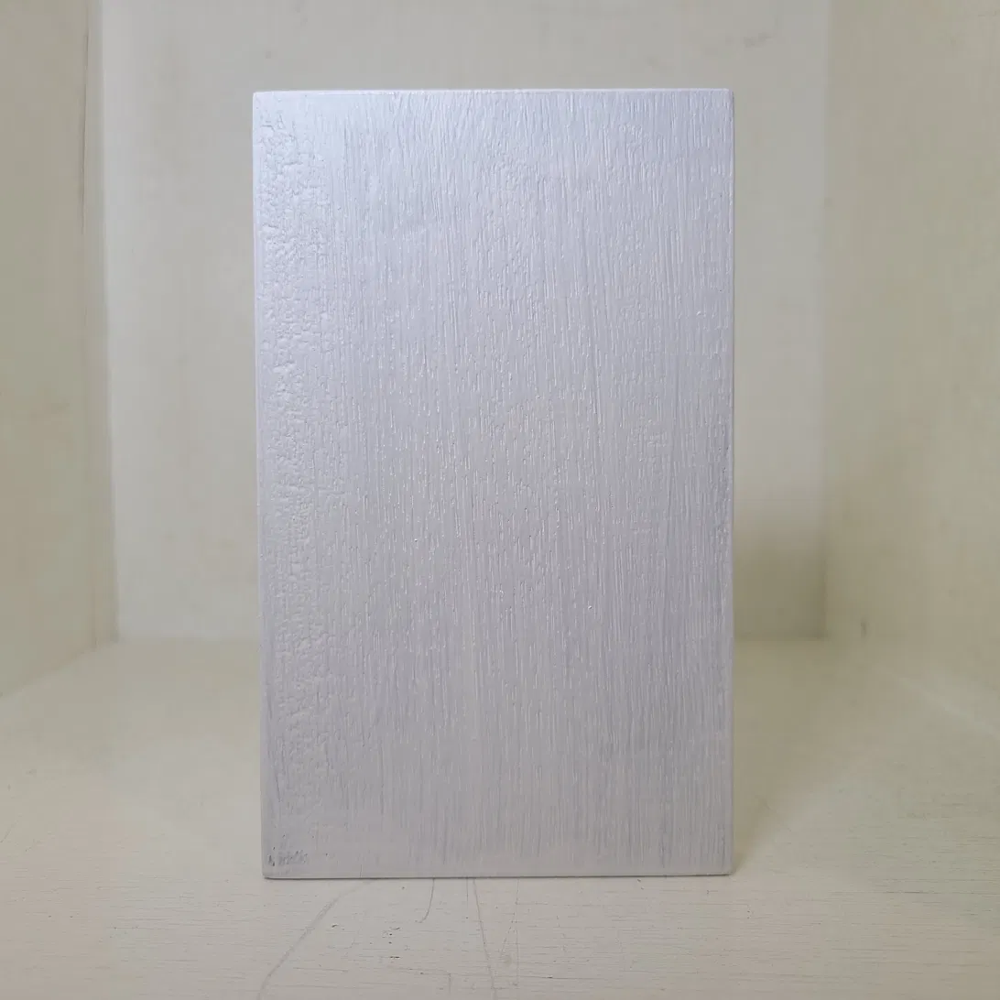
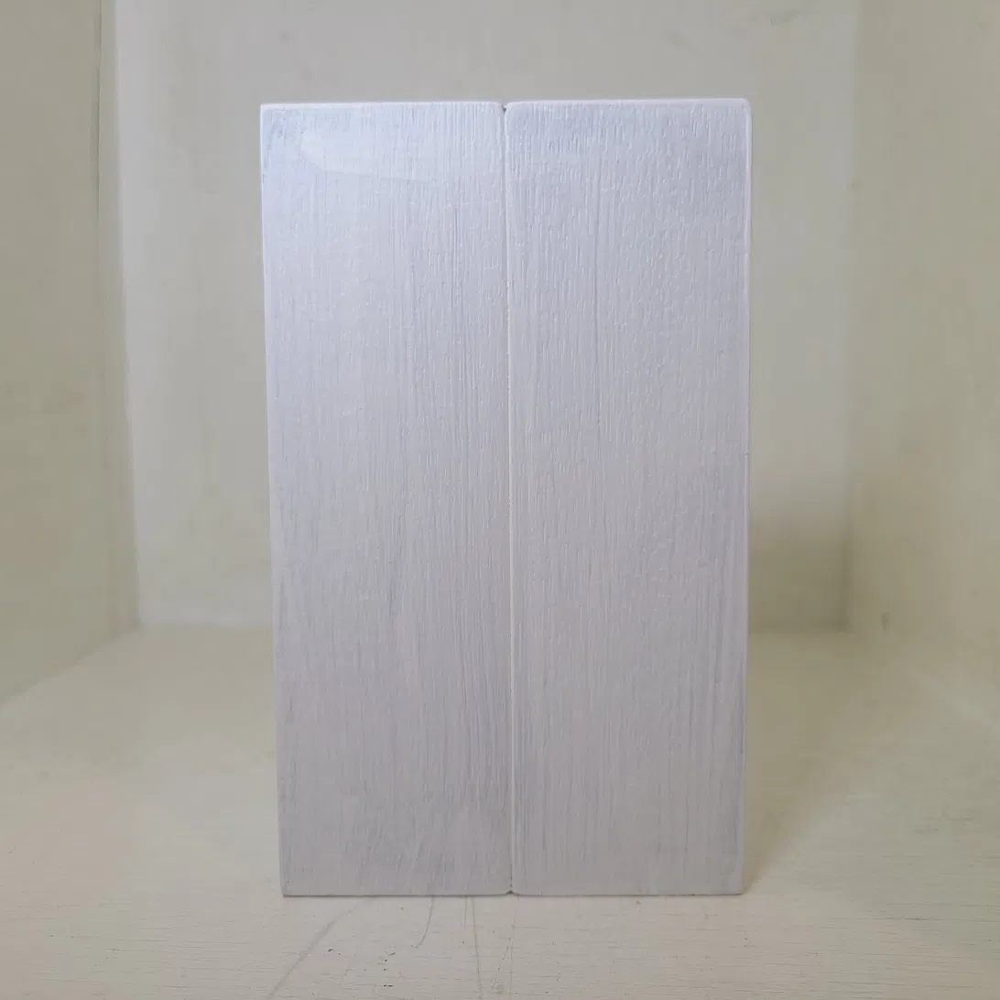
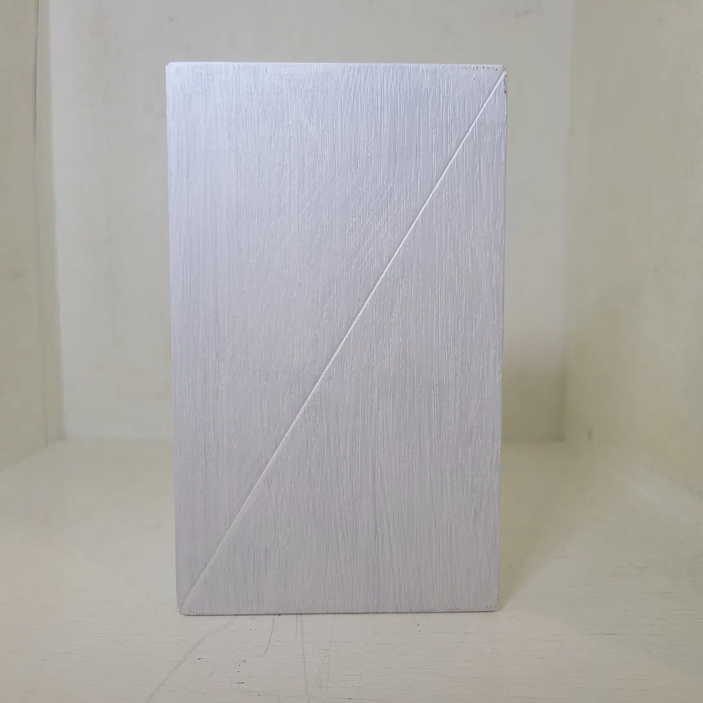
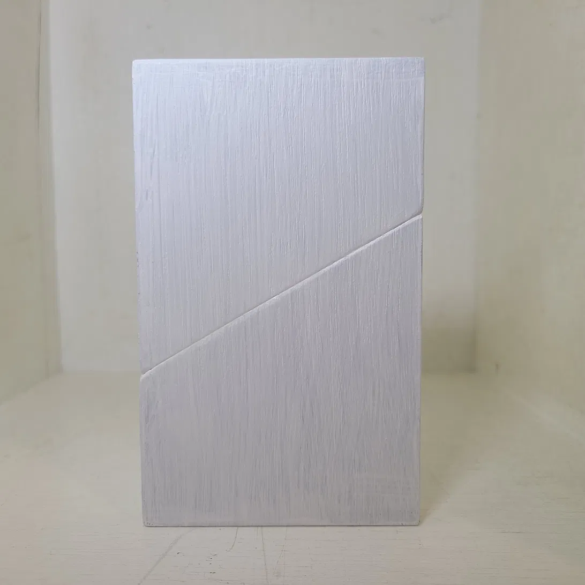
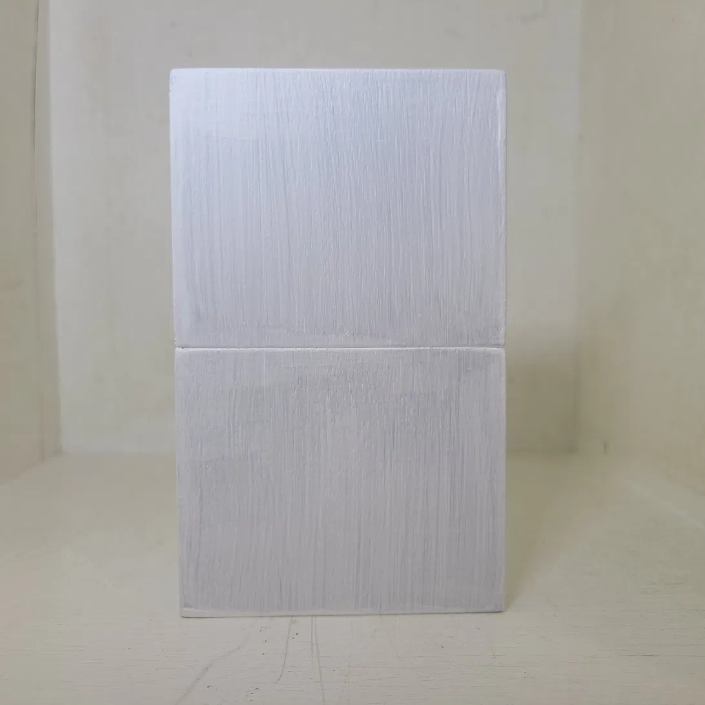

# Cut & Build 1 (2026)

素材: 木材、アクリル塗料(白)
サイズ: 15 × 9 × 1.5 cm

## 制作意図

<!-- ここに確定済みのバイリンガル・アーティストステートメントを貼り付けてください -->
<!-- Paste your finalized bilingual artist statement here -->

「構造が要求し、形が応える、手が収束する、観者が完成させる」

## 画像 / Images

### 未切断 / Uncut

### 切断 0° / Cut at 0°

### 切断 30° / Cut at 30°

### 切断 60° / Cut at 60°

### 切断 90° / Cut at 90°

---

[← 作品一覧に戻る](../../)
