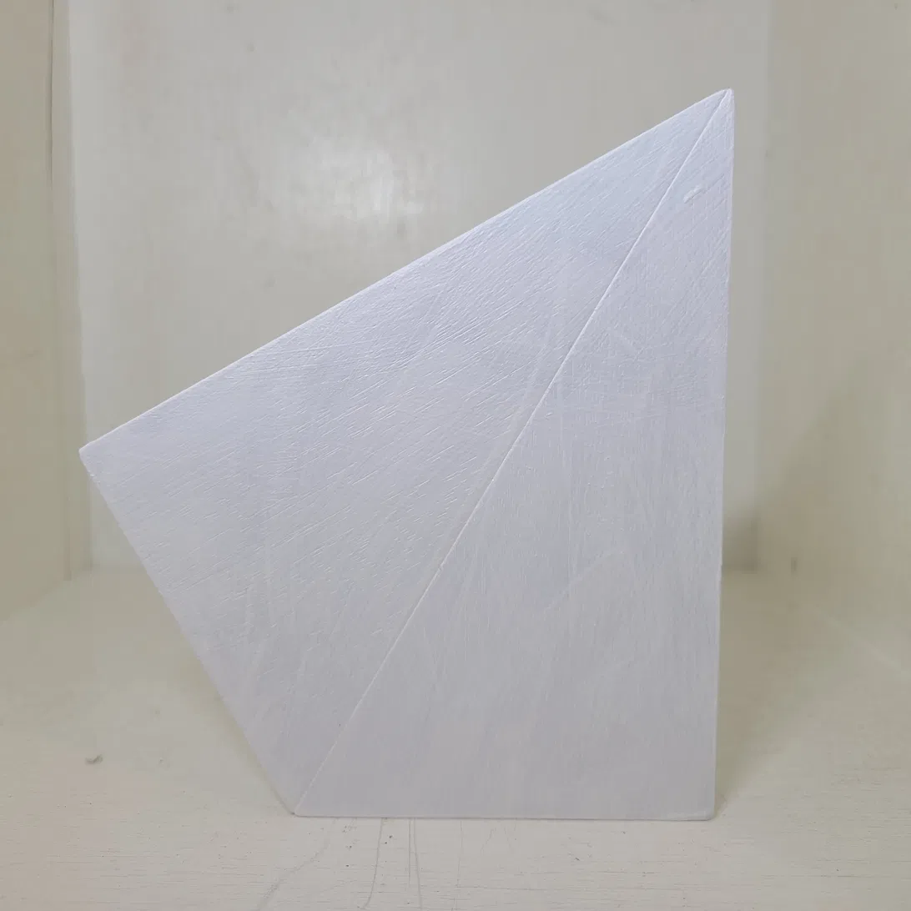
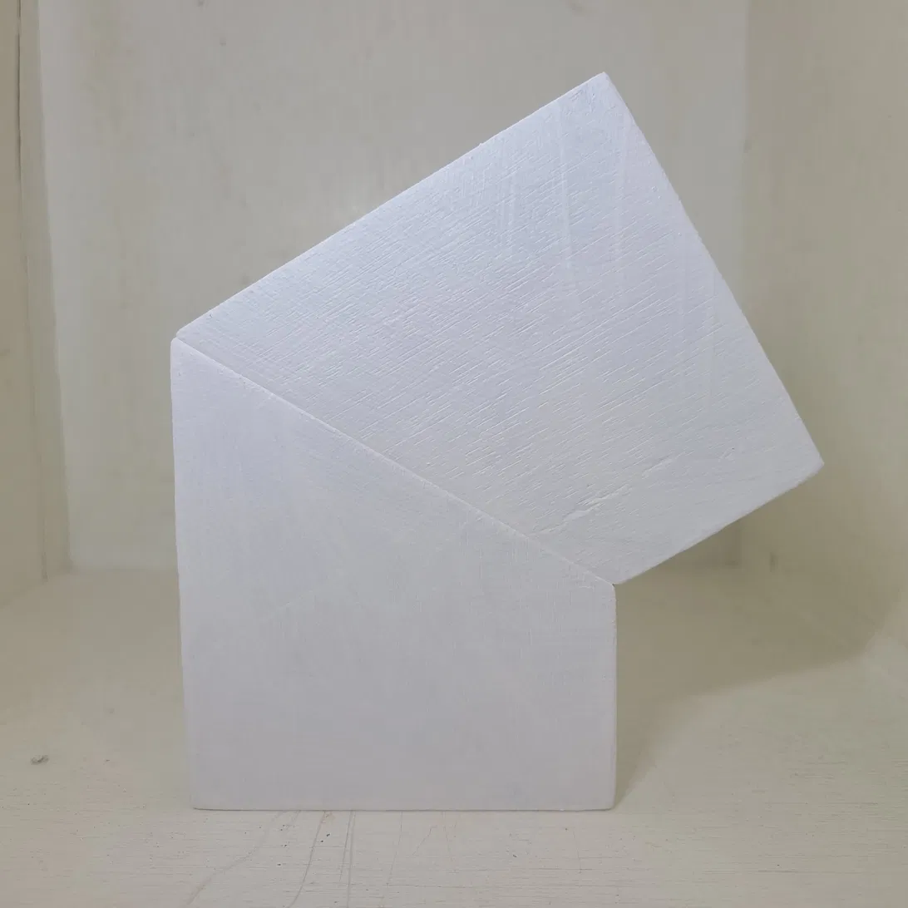
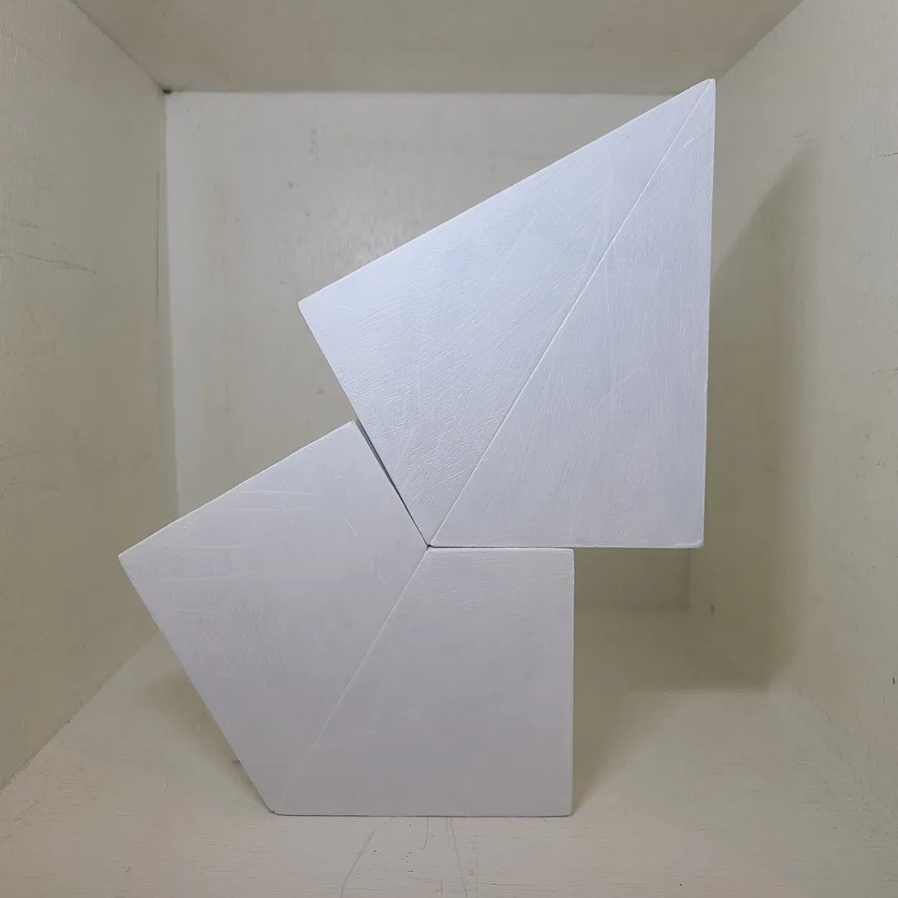

Material: Wood, acrylic paint (white)
Size: 15 × 9 × 1.5 cm

## Artist Statement

"A series in which boards with a 10:6:1 ratio are cut and reassembled. When the 30° and 60° cuts are rejoined with one piece reversed, a 120° relationship emerges between the two. Not by design — but as something the structure itself demanded."

## Images

### Cut at 30°, reversed

### Cut at 60°, reversed

### 120° relationship

---
[← Back to Works](../../)
