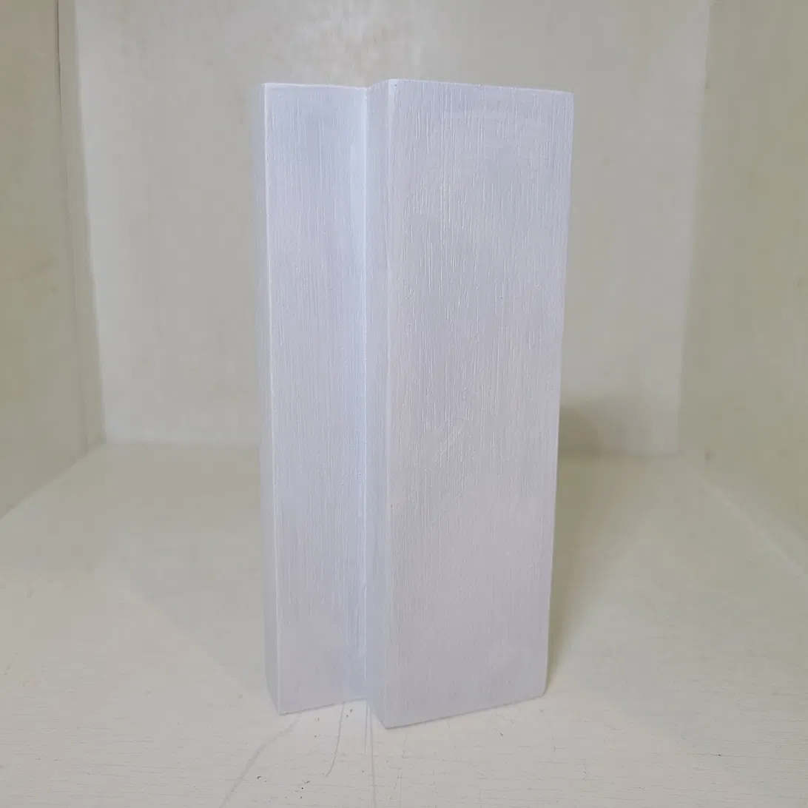
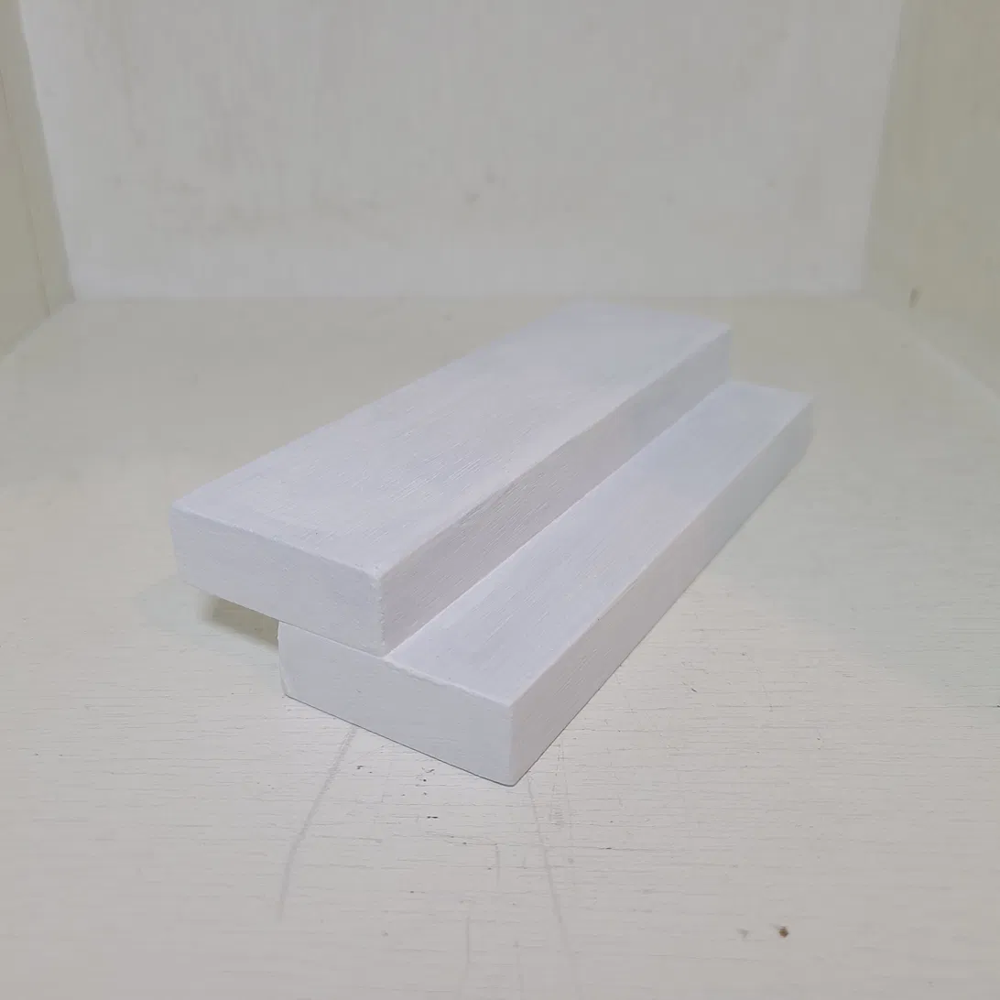
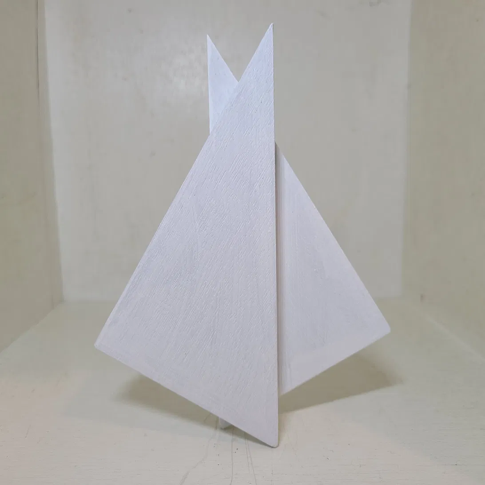
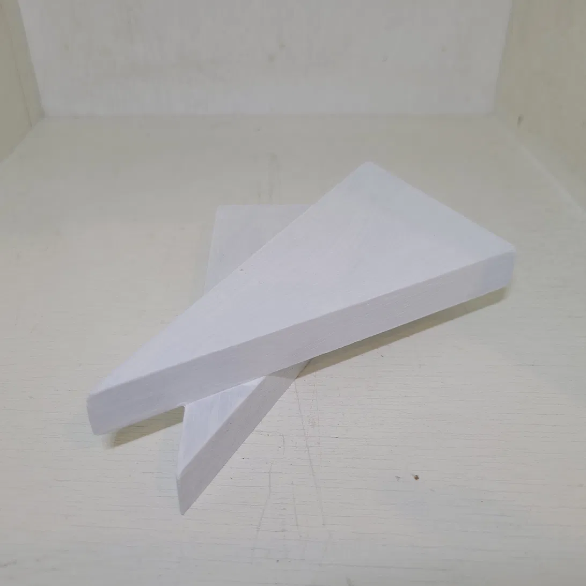
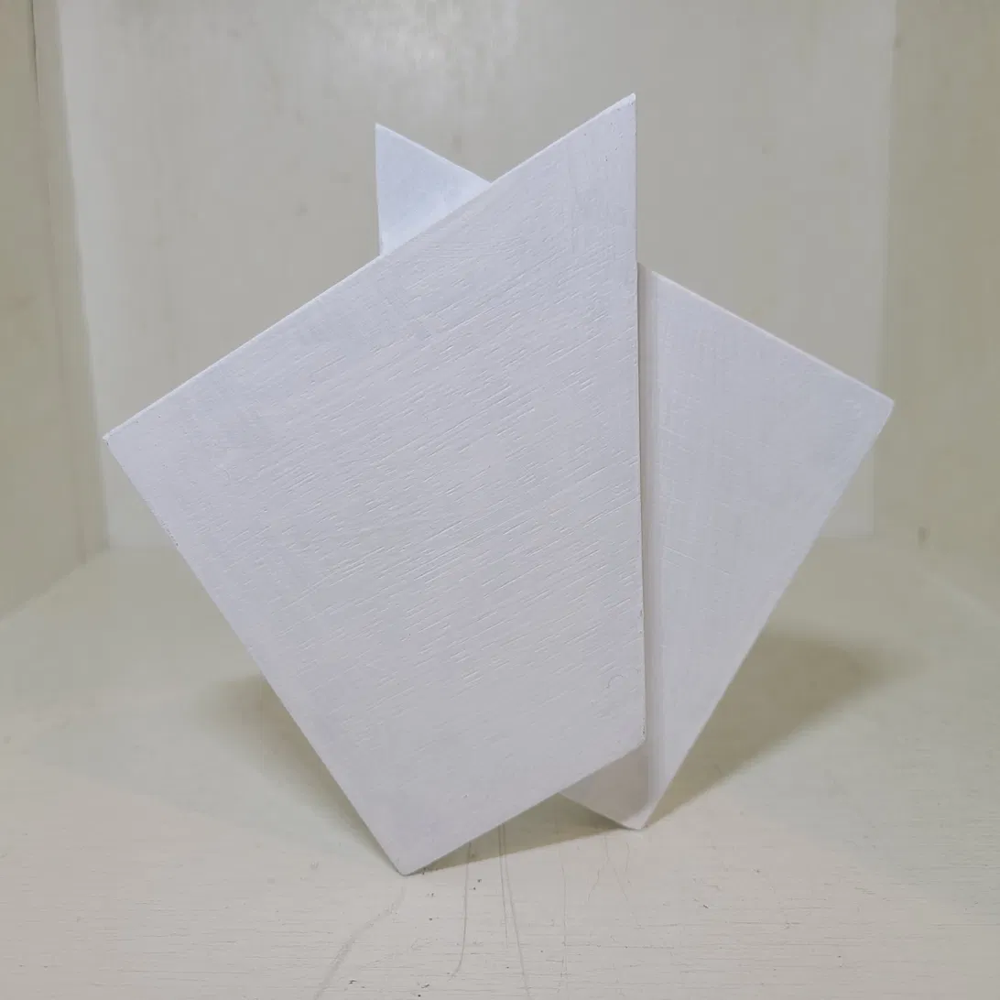
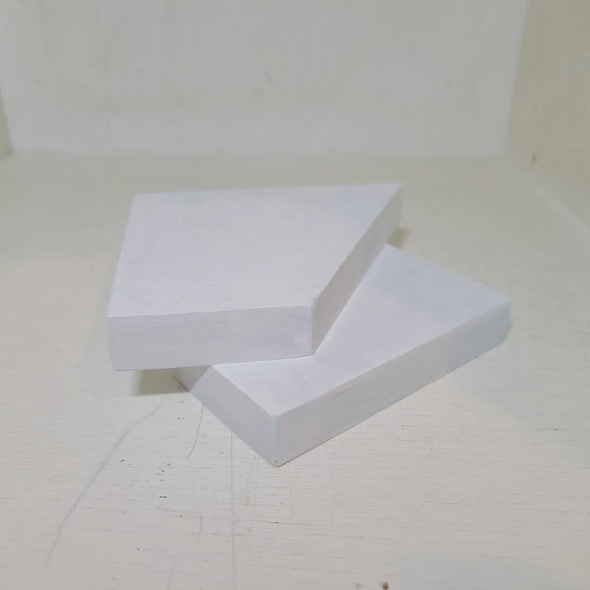
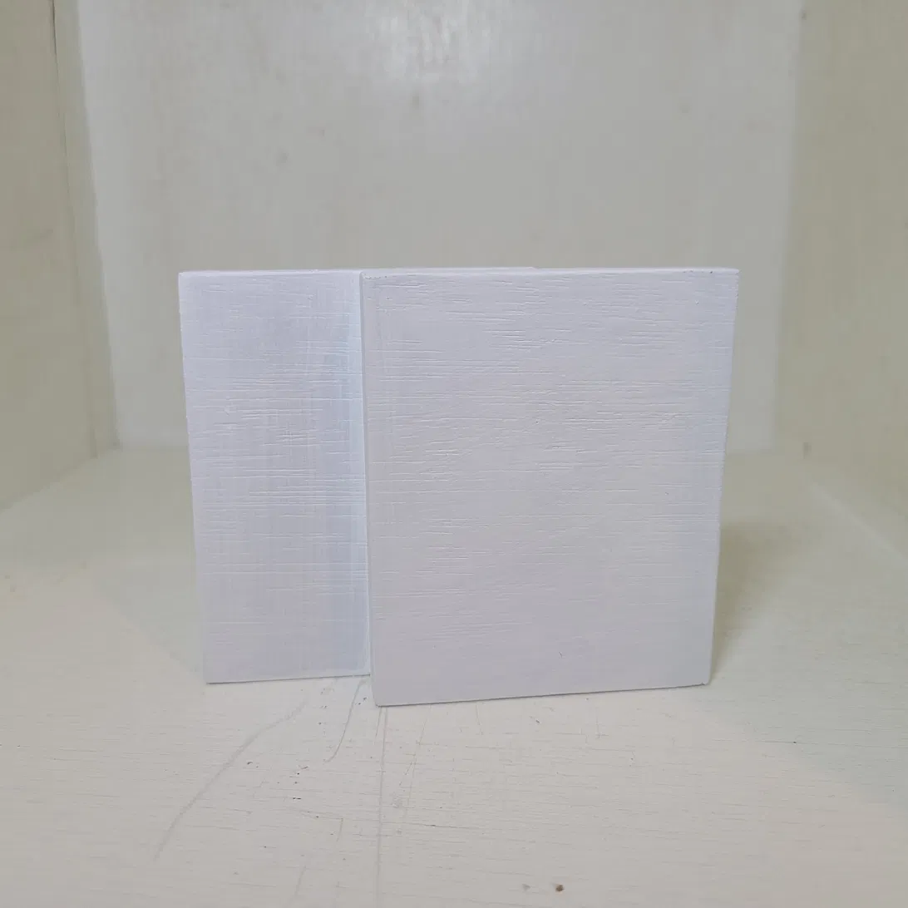
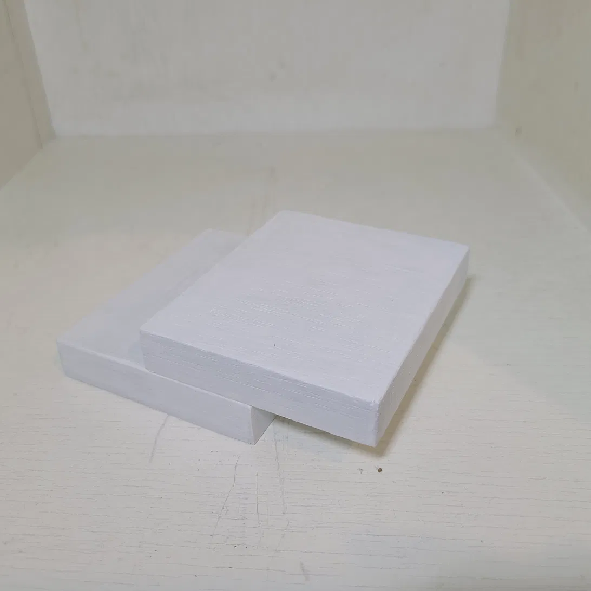

Material: Wood, acrylic paint (white)
Size: 15 × 9 × 1.5 cm

## Artist Statement

"A series in which boards with a 10:6:1 ratio are cut at four angles — 0°, 30°, 60°, and 90° — then reversed, shifted, and rejoined.

At 0° and 90°, reversal changed nothing: the form stayed identical to its non-reversed state.

At 30° and 60°, no reciprocal relationship appeared this time — unlike the 120° that emerged in Cut & Build 2. The two pieces simply became independent, separated from one another.

Not a relationship this time — but its absence, equally demanded by the structure."

## Images

### Cut at 0°, reversed parallel join

### Cut at 30°, reversed parallel join

### Cut at 60°, reversed parallel join

### Cut at 90°, reversed parallel join

---

[← Back to Works](../../)
