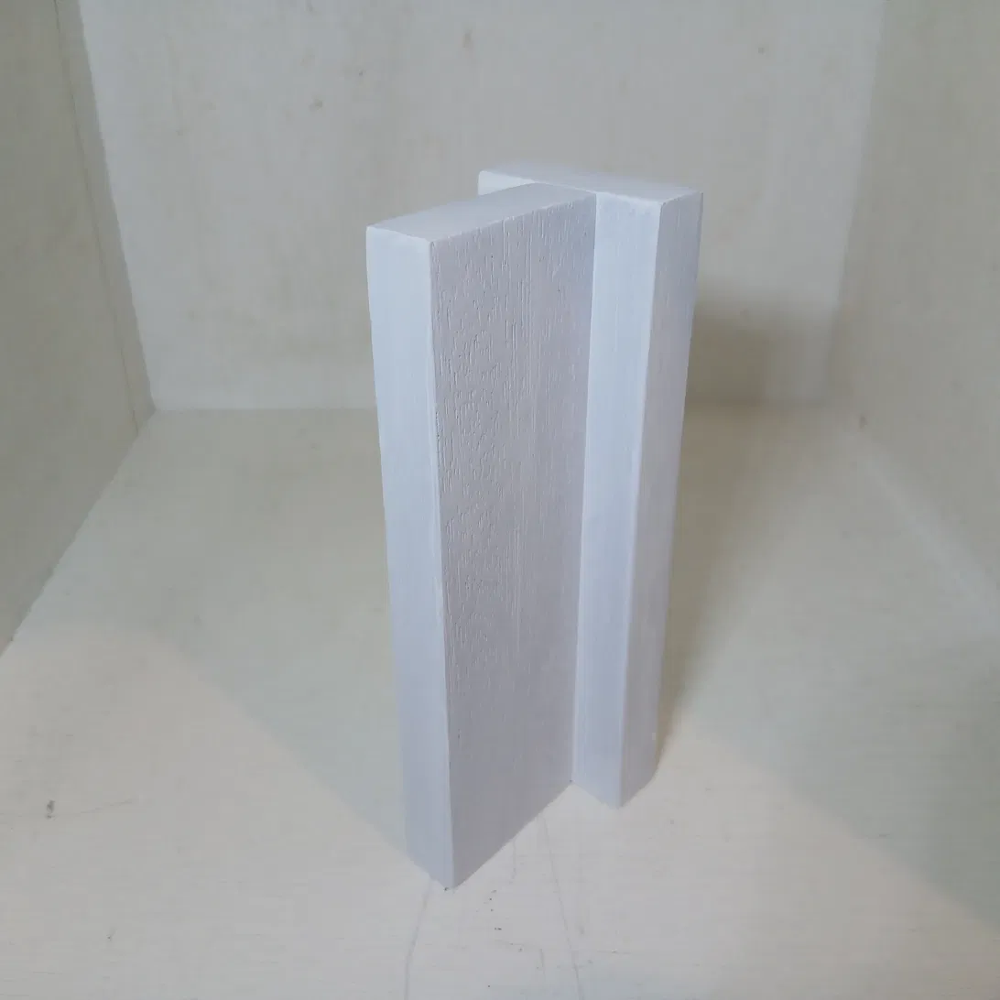
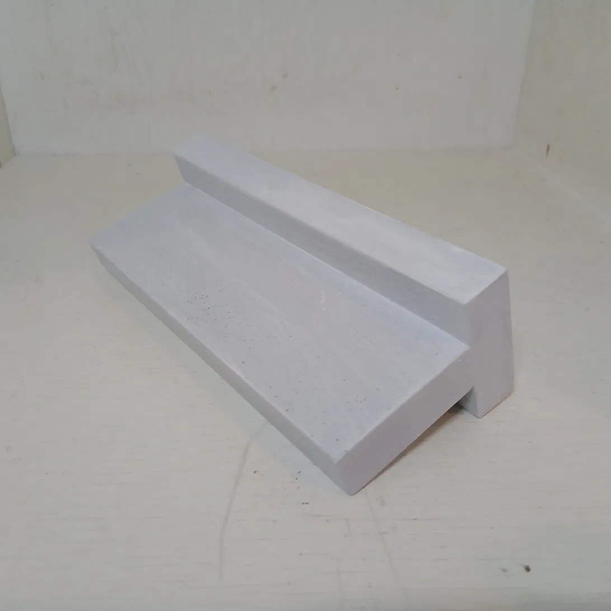
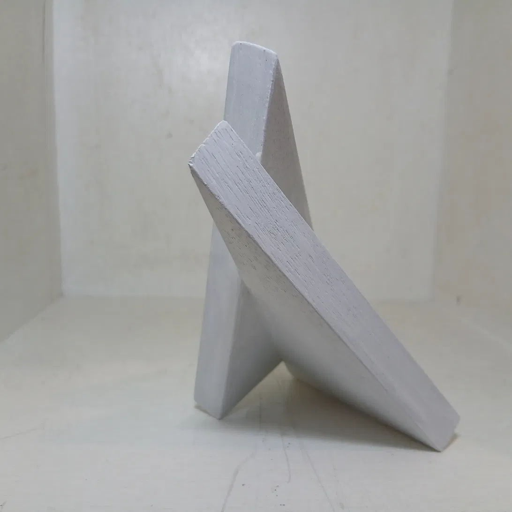
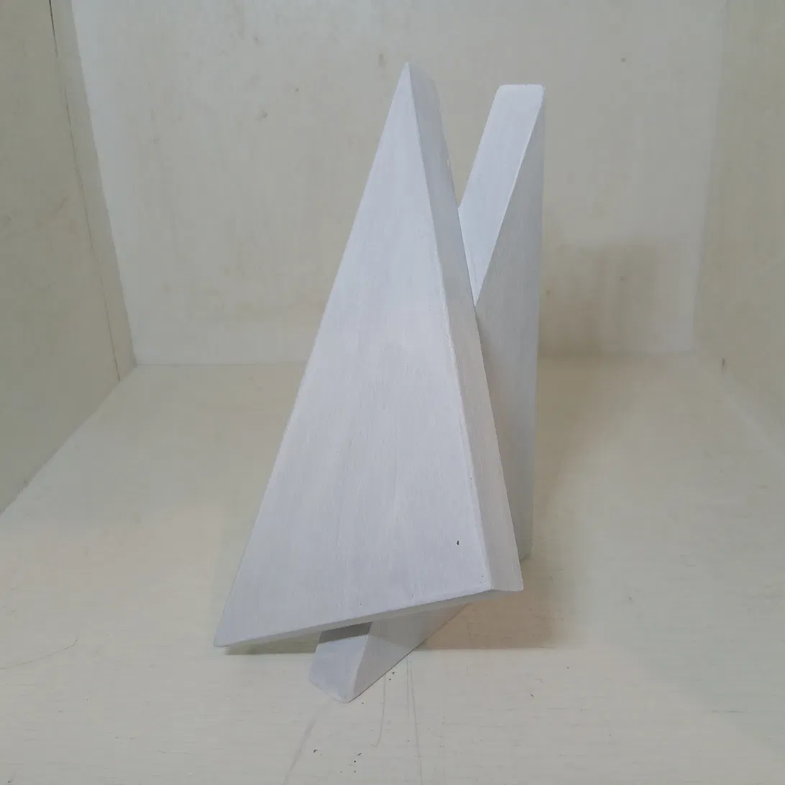
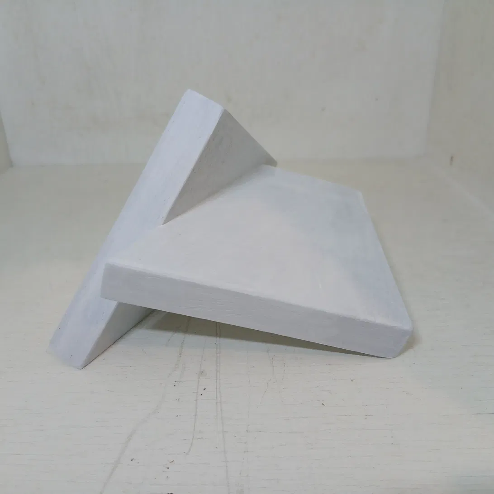
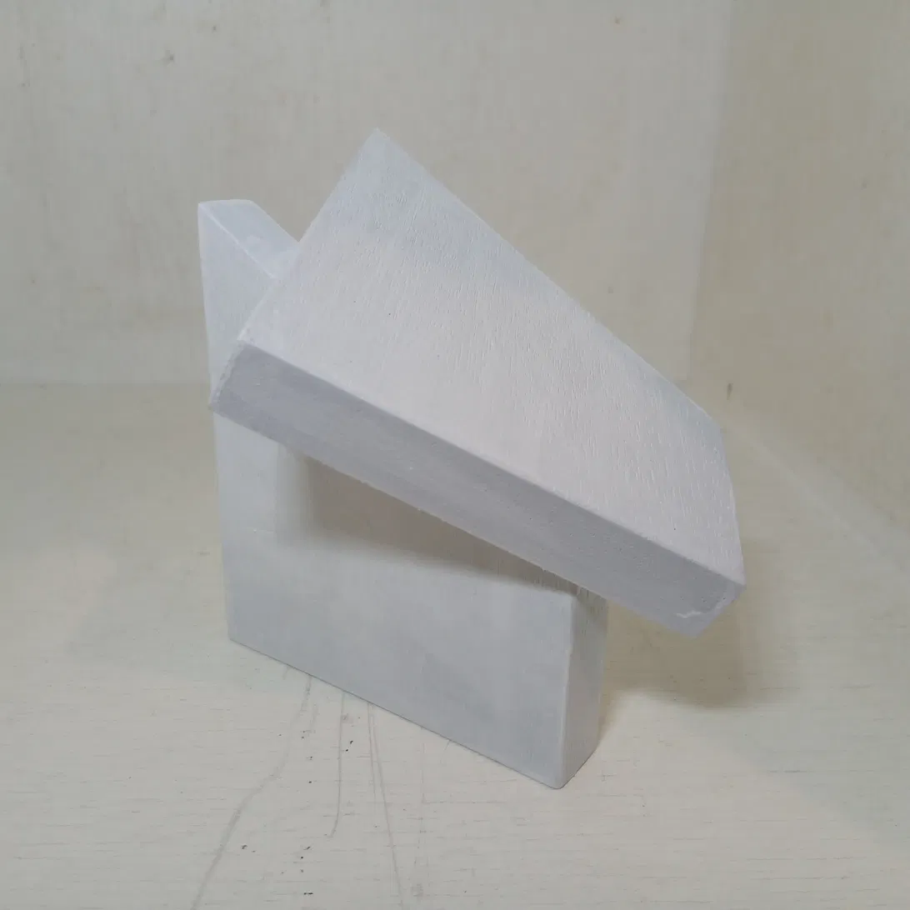
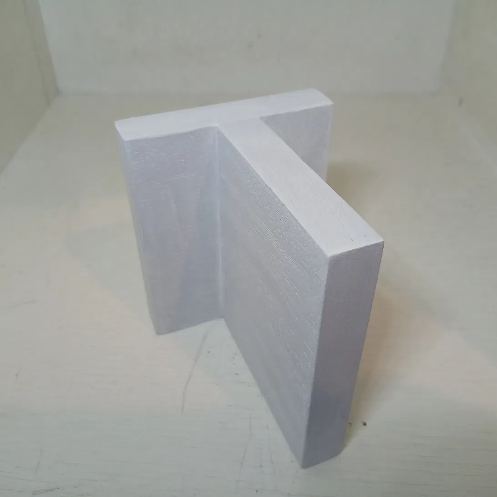
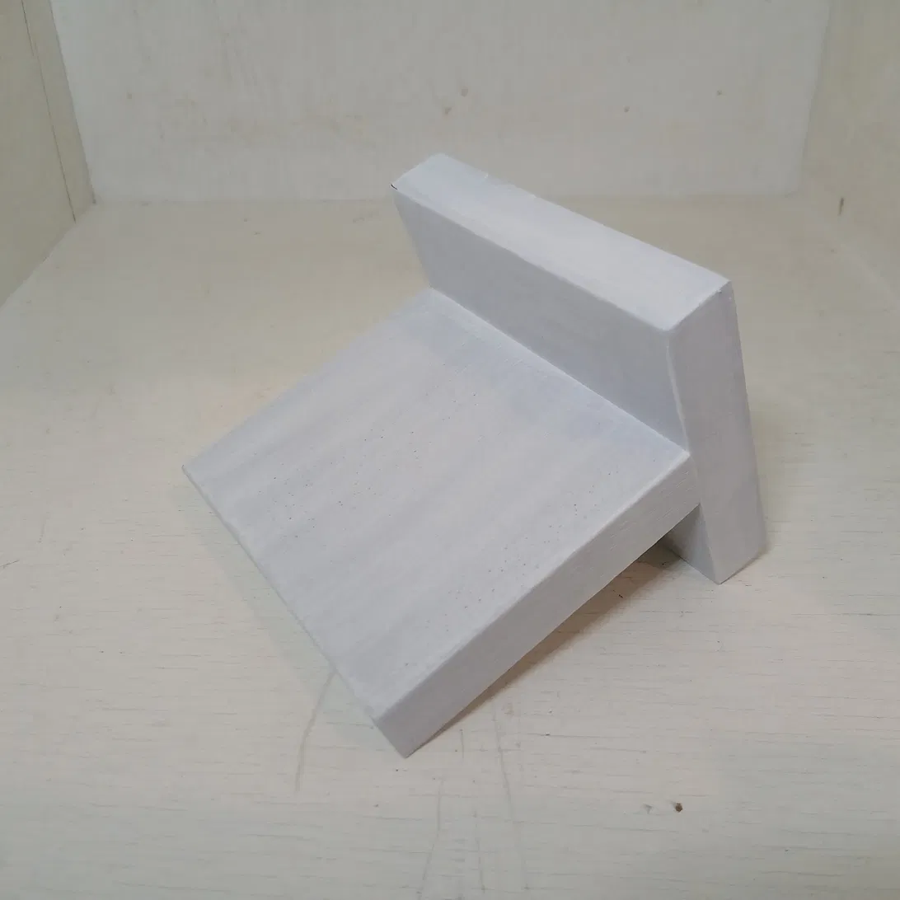

Material: Wood, acrylic paint (white)
Size: 15 × 9 × 1.5 cm

## Artist Statement

"All cuts originate from the center of gravity. Vertical bonding connects mass to gravity — the axis through the center of gravity defines up and down, and that axis is also the center of rotation."

## Images

### Cut at 0°, vertical bonding

### Cut at 30°, vertical bonding

### Cut at 60°, vertical bonding

### Cut at 90°, vertical bonding

---

[← Back to Works](../../)
