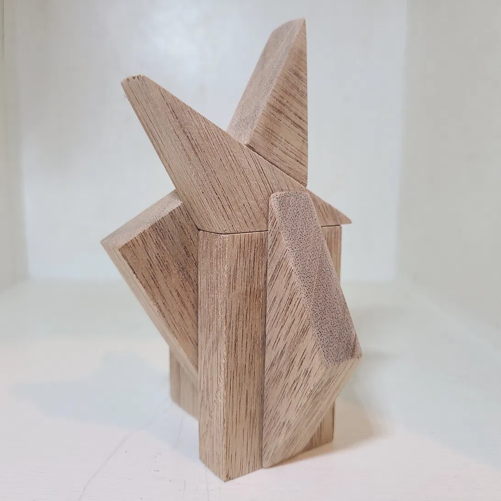

## Work line — study

## Statement

Within Cut & Build, the **Structural line** makes the theory's structure visible; the **Work line** lets cut pieces combine freely, giving rise to a *form*.

This study does not aim at completion. It moves through stages — cut board → combined form → white-painted → further alteration → further alteration → ... — continuing to transform without end. Impressions and sensations drawn from each transformation feed back into both the Structural line and the Work line.

Each stage of this transformation is recorded and minted as an NFT — a photograph, a statement, and its connection to the E=mc Thought Principle, tied to a specific moment in time.

## Stage 0 — Cut State

Four cuts through the center of gravity of a single board, at angles of 0°, 30°, 60°, and 90°, dividing it into eight fragments. Not yet combined, not yet transformed — only the state of possibility, divided. This is the origin point from which the piece will begin to take form.

[NFT #0: Cut State — View on OpenSea →](https://opensea.io/item/polygon/0xb5cf09c66e6deb732bb96b57b6a15d807a1c8905/1)

## Stage 1 — Build

The eight fragments cut in Stage 0 are freely recombined, not returned to their original cut faces. A flat, divided board becomes a standing form. No paint, no color — only wood grain, and the seams where fragments meet. The form was not planned in advance; it was found through combining. Combination has happened. Coloring has not yet begun.

[NFT #1: Build — View on OpenSea →](https://opensea.io/item/polygon/0xb5cf09c66e6deb732bb96b57b6a15d807a1c8905/2)

---

[← Back to Works](../../)
