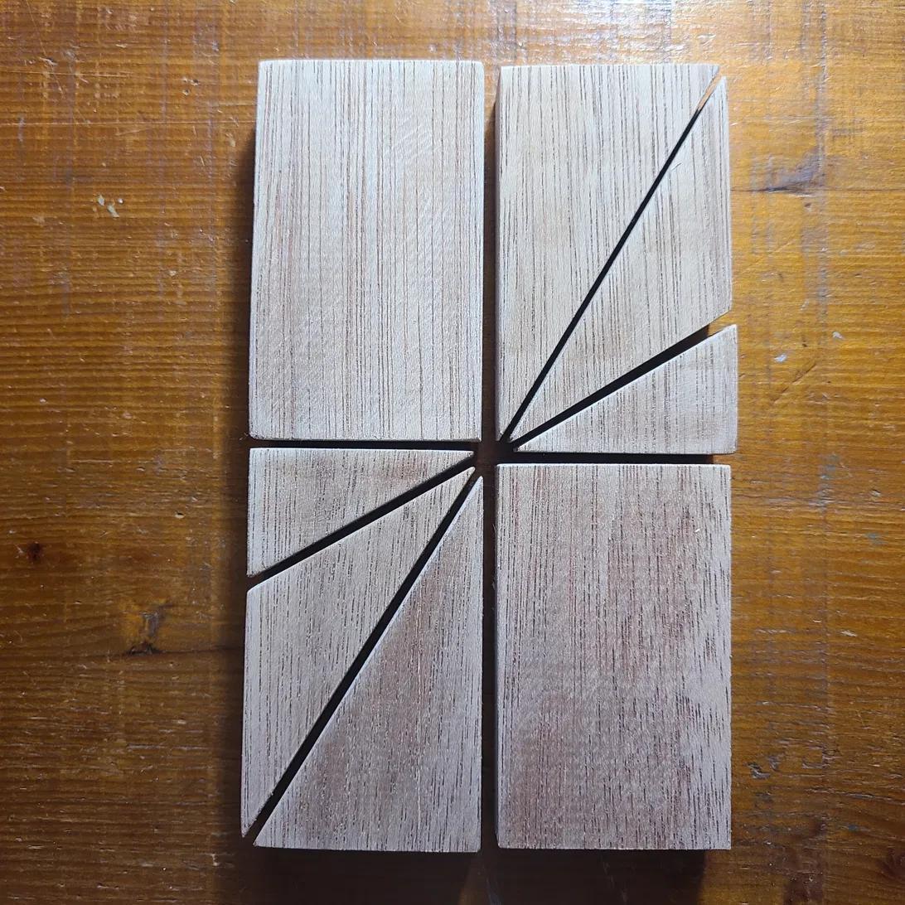

# Study 1 (2026)

Work line — study

## Statement

Within Cut & Build, the **Structural line** makes the theory's structure visible; the **Work line** lets cut pieces combine freely, giving rise to a *form*.

This study does not aim at completion. It moves through stages — cut board → combined form → white-painted → further alteration → further alteration → ... — continuing to transform without end. Impressions and sensations drawn from each transformation feed back into both the Structural line and the Work line.

Each stage of this transformation is recorded and minted as an NFT — a photograph, a statement, and its connection to the E=mc Thought Principle, tied to a specific moment in time.

## Stage 0 — Cut State

The board is cut into the pieces that will be combined into a standing form. This is the structural origin from which the piece begins to transform.

[NFT #0: Cut State — View on OpenSea →](https://opensea.io/item/polygon/0xb5cf09c66e6deb732bb96b57b6a15d807a1c8905/1)

---

[← Back to Works](../../)
