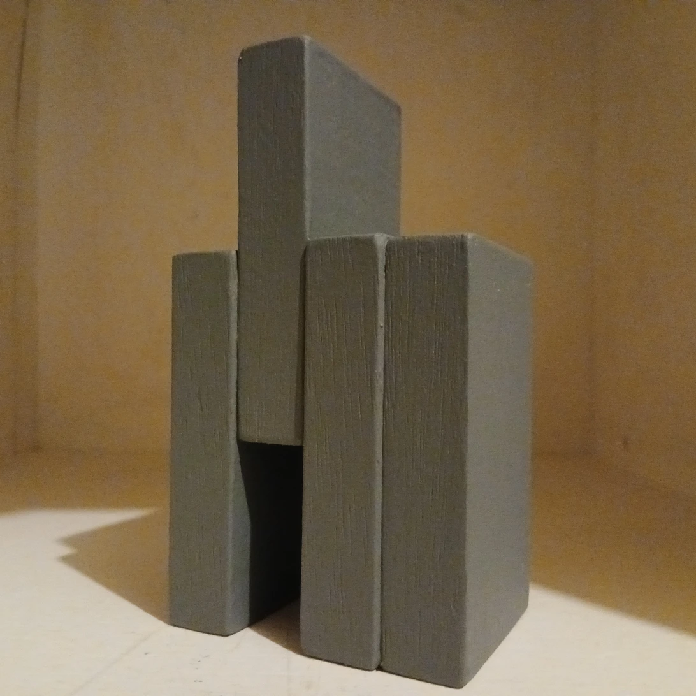
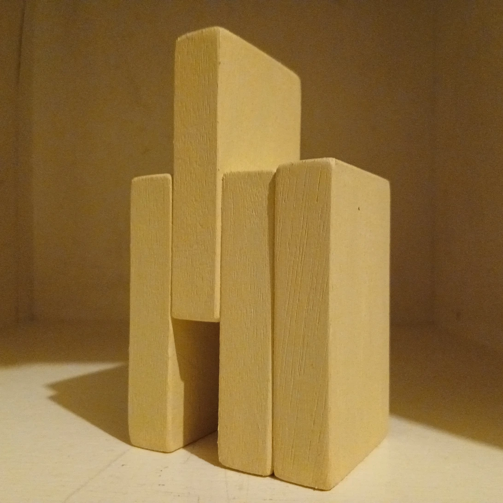
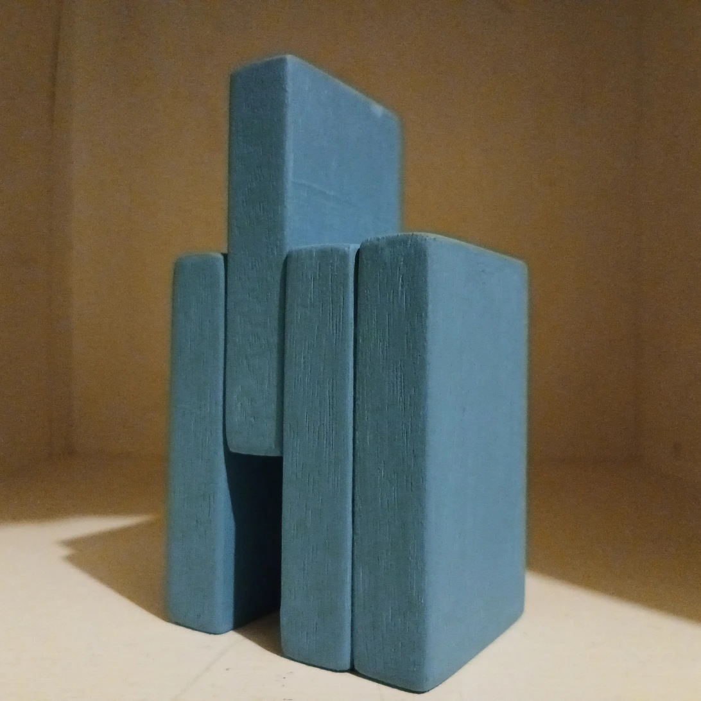
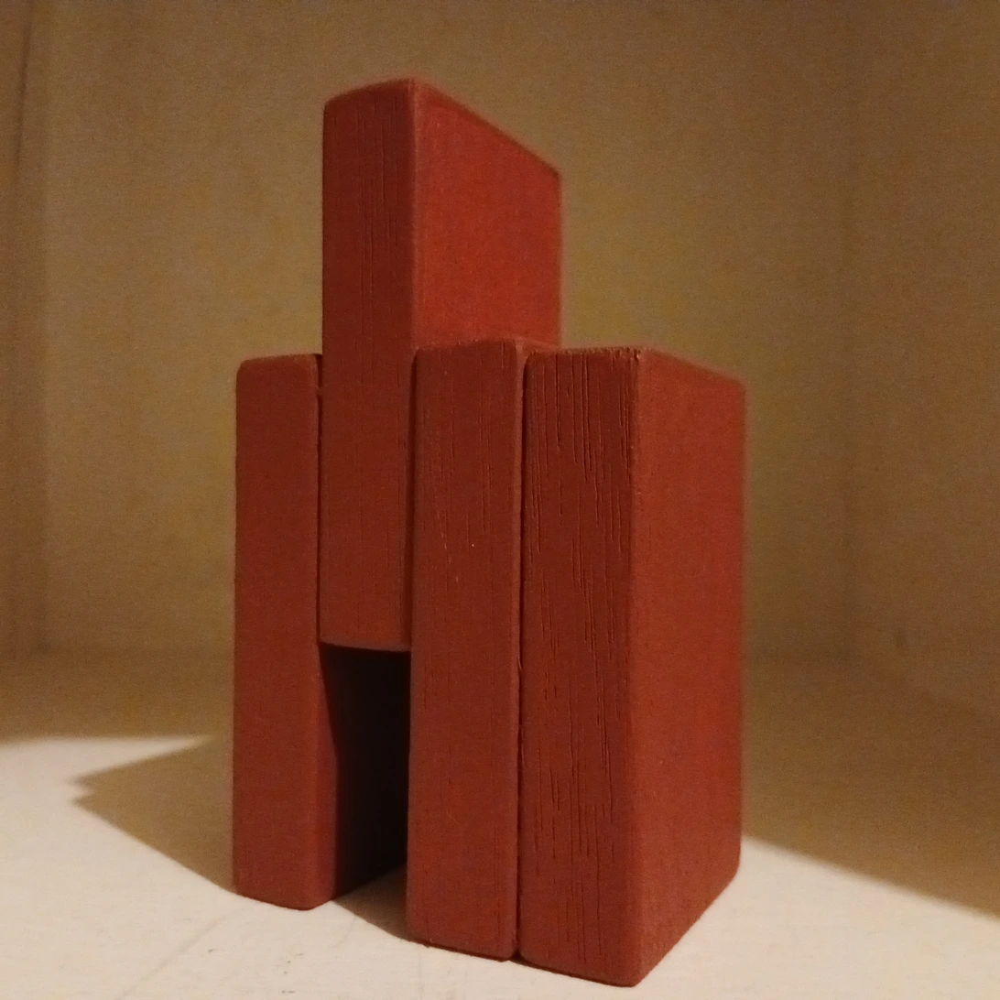

[Cut & Build — Katsutoshi Mayumi Art Work Archive](https://katsith-emc.github.io/cut-and-build/)

## Work line — standard form (STD)

## Statement

Uniform wooden boards, cut at 0° and 90° into four pieces. The simplest build — a stack — with one piece shifted upward, deliberately, as each work's only structural gesture. Four individually complete objects, made this way, painted gray, beige, blue, and red.

These four objects are connected not by process but by relation. Each relation is recorded independently of the objects it connects — the sculptures exist as physical things and may pass to different hands, while the relation stays where anyone can find it, regardless of who owns what it connects.

Four relations, in time, close into a loop: work1a → work1b → work1c → work1d → work1a. When the loop closes, work1-1 becomes STD — not because each object is finished (each already was), but because the set of relations connecting them has closed with no remaining open end.

## The Four Objects

**work1a** — gray

**work1b** — beige

**work1c** — blue

**work1d** — red

## Relation 1/4 — work1a → work1b

Between them: a contrast inversion, and a slight increase in saturation. This NFT does not hold either object — it holds only what stands between them.

### [NFT: Relation 1/4 (work1a → work1b) — View on OpenSea →](https://opensea.io/item/polygon/0xb5cf09c66e6deb732bb96b57b6a15d807a1c8905/7)

## Relation 2/4 — work1b → work1c

Between them: a slight increase in saturation, and a slight decrease in value.

### [NFT: Relation 2/4 (work1b → work1c) — View on OpenSea →](https://opensea.io/item/polygon/0xb5cf09c66e6deb732bb96b57b6a15d807a1c8905/8)

## Relation 3/4 — work1c → work1d

Between them: an increase in saturation, and a decrease in value.

### [NFT: Relation 3/4 (work1c → work1d) — View on OpenSea →](https://opensea.io/item/polygon/0xb5cf09c66e6deb732bb96b57b6a15d807a1c8905/9)

## Relation 4/4 — work1d → work1a

Between them: saturation disappears, and value becomes a structural contrast rather than a chromatic one. This relation does not extend the sequence — it closes it. Four independent objects, four relations, now forming one closed set rather than an open line.

### [NFT: Relation 4/4 (work1d → work1a) — View on OpenSea →](https://opensea.io/item/polygon/0xb5cf09c66e6deb732bb96b57b6a15d807a1c8905/10)

---

[← Back to Works](../../)
