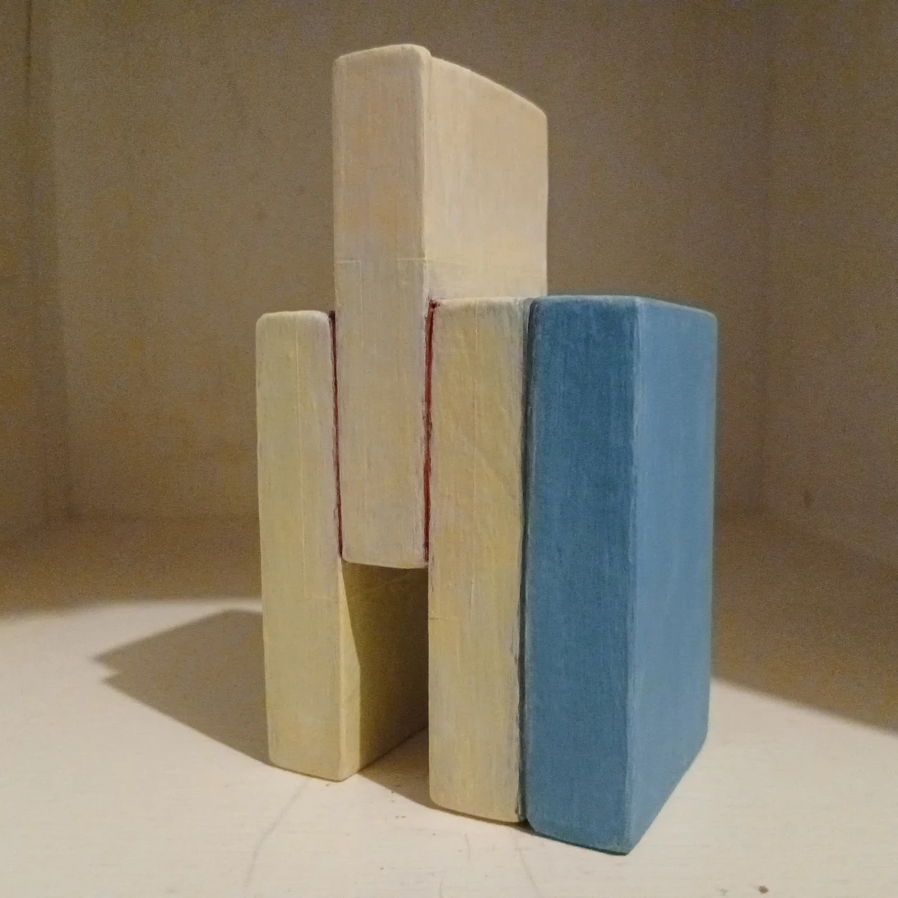

[Cut & Build — Katsutoshi Mayumi Art Work Archive](https://katsith-emc.github.io/cut-and-build/)

## Work line

## Statement

Uniform wooden boards, cut at 0° and 90° into four pieces. The simplest build — a stack — with one piece shifted upward, deliberately, as the work's only structural gesture.

Work2 is a single, independent object — not a set of four, and not itself a relation. Its color treatment stands in reference to relations already recorded elsewhere in the Work line.

Its face — the largest formal element of the shape — carries beige and blue, the same two colors that the relation between work1b and work1c already marked on the blockchain. Its seams — the joints where the four pieces meet — carry red and gray, receded into the gaps rather than covering the faces, the same two colors that the relation between work1d and work1a, closing the loop, already marked.

These NFTs do not describe why. They only state that Work2's face and seam treatments stand in reference to those existing relations, not to any of the physical objects those relations once connected. Work2 may pass to another hand, as work1a, work1b, work1c, and work1d already have. These references do not. They stay where anyone can find them, independent of who owns what they point to.

## Reference 1 — Face: Beige / Blue

Work2's face carries beige and blue, in reference to the relation between work1b and work1c.

### [NFT: Reference — Work2 → Relation 1b–1c — View on OpenSea →](https://opensea.io/item/polygon/0xb5cf09c66e6deb732bb96b57b6a15d807a1c8905/12)

## Reference 2 — Seams: Red / Gray

Work2's seams carry red and gray, in reference to the relation between work1d and work1a — the relation that closed the loop.

### [NFT: Reference — Work2 → Relation 1d–1a — View on OpenSea →](https://opensea.io/item/polygon/0xb5cf09c66e6deb732bb96b57b6a15d807a1c8905/13)

---

[← Back to Works](../../)
